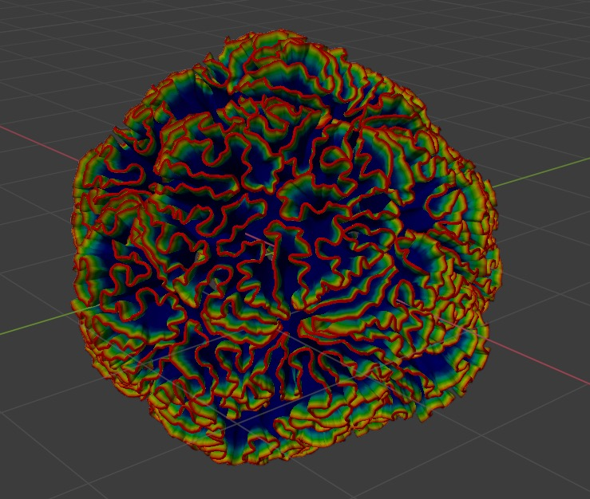
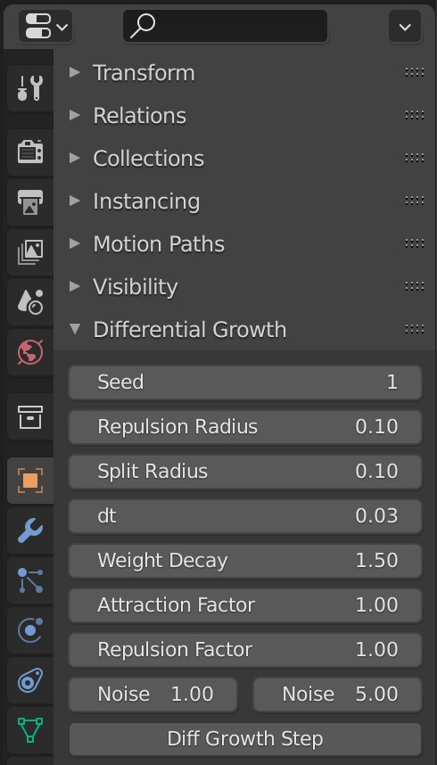
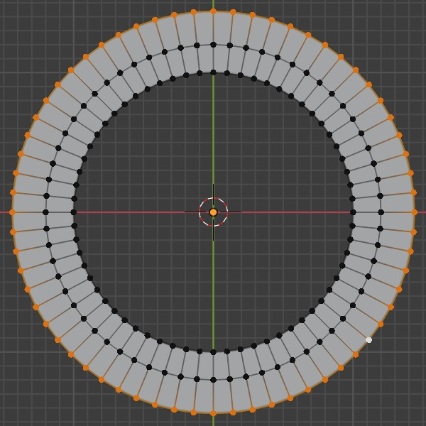
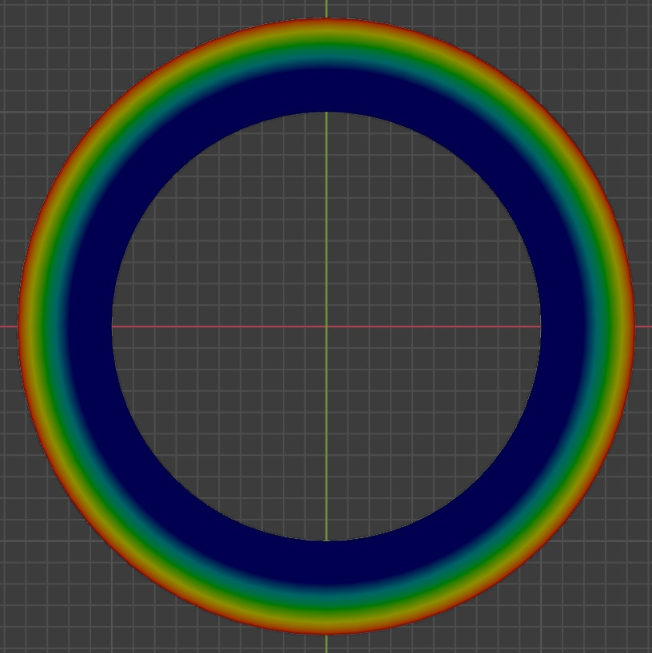
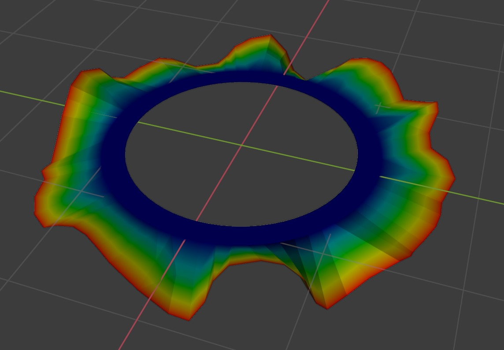
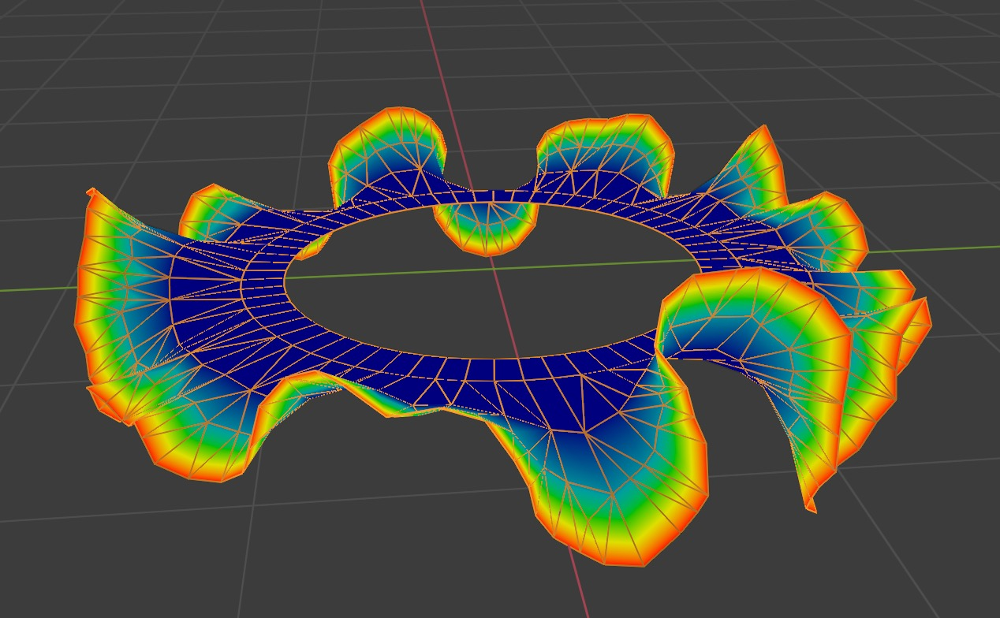
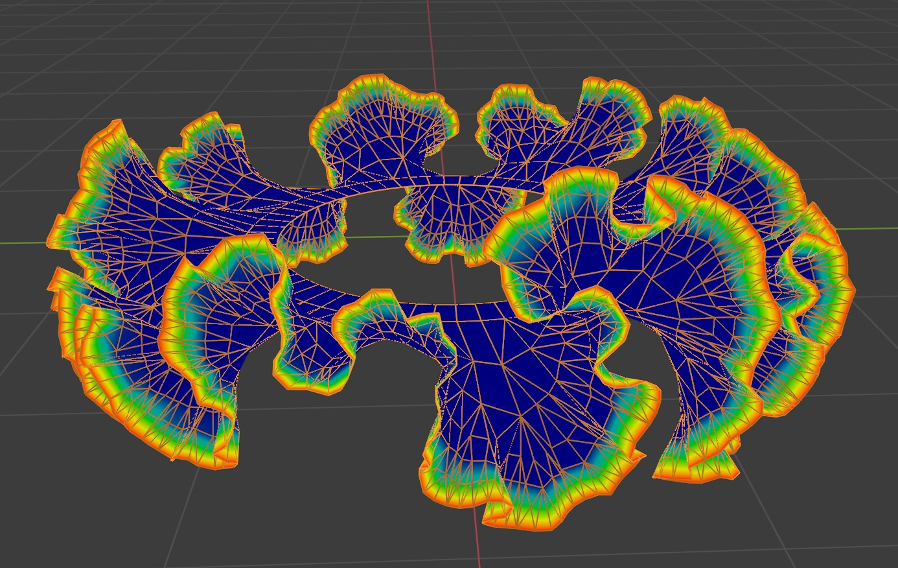
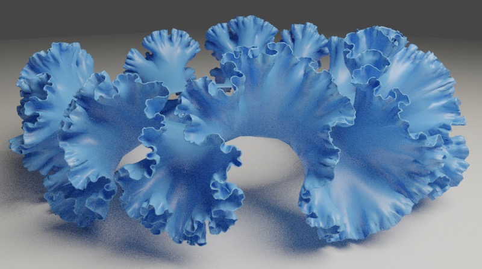

# Differential Growth



## Introduction

Differential growth refers to a series of generative design algorithms inspired by the growth occurring in living organisms and other kinds of natural forms.

If you spend enough time on Pinterest looking for intricate generative growth algorithms, you'll eventually stumble upon stunning works by many generative artists. These guys are indisputable geniuses and their works are an incredible source of inspiration which [made this addon possible](#credits).

However, the tools used to create these works of art seem to fall into two categories:

a) closed-source in-house software developed by profit-oriented studios
b) professional software like Grasshopper 3D + Rhino costing $$$$

This addon is a humble attempt to change that, aiming at providing a widely accessible differential growth toolkit for [Blender](https://www.blender.org/) — the World's best CG platform.

## Installation

1. Download a zip file from [Releases](https://github.com/inca/blender-differential-growth/releases)
2. Install the addon in Blender by going to Edit > Preferences > Addons > Install

## Usage

### How it works

The addon creates a "Differential Growth" section in Object menu.



The growth is implemented using simulation steps. On each step the algorithm will move the vertices designated by an active vertex group (weight paint) according to the following rules:

- each vertex is **attracted** to its adjacent vertices
- each vertex is **repelled** from its surrounding vertices
- each vertex is also moved in an arbitrary direction by sampling a 3D **noise** at its current location
- edges that exceed **split radius** will get subdivided, which typically result in vertices being pushed away from its surroundings
- "older" vertices eventually get frozen in place with **weight decay**

### Quick tutorial

1. Start by creating a Circle with 64 segments. Go to edit mode, select all the vertices, type `E > S > 1.2 > Enter` (this will extrude the edges and scale them 120%). Repeat one more time to have three edge loops in total.

  

2. With outer edge loop selected go to Properties > Data > Vertex Group. Press "+" to create a vertex group, then press "Assign" to assign `1.0` weight to selected vertices. Switch to Weight Paint, the outer loop should be red, whilst all others should be blue.

  

3. Go to Object > Differential Growth. Let's start with high noise and low edge resolution at first. Set both "Repulsion Radius" and "Split Radius" to `0.3` (note, that's roughly double size of each outer edge). Also set Noise Factor to `10` and Noise Scale to `2`.

4. Press "Diff Growth Step" a number of times until you start seing wavy patterns. The "dt" parameter controls a "time step" (i.e. how much overall growth occurs at one given step). By default the value is `0.025` which results in tiny increments; you may want to switch it to `0.05` initially, then revert to `0.025` when it comes to finer detail.

  

5. At some point set the "Noise Factor" to `1.0` and "Noise Scale" to `5.0` to start applying slightly finer and more delicate noise. Continue with `0.3` resolution until you're happy with the base form.

6. Now switch both "Repulsion Radius" and "Split Radius" to `0.2` and run a couple of steps. You should see more intricate details starting to appear, as well as mesh resolution dynamically increasing around the edges.

  

7. Keep it going until you like what you see. At some point make one more increase to the resolution by setting both "Repulsion Radius" and "Split Radius" to `0.1`. At this point it's a good idea to run slower with "dt" set to `0.025` or similar value.

  

8. Keep increasing the resolution, tweaking noise and refining until you achieve the form you like. The overall idea is to start with low resolution to define the "big" shape, then gradually increasing the resolution to introduce more intricate details. You can go for as many details as you want (but keep an eye on mesh statistics). Also, if you feel like you've gone too far, Undo, Duplicate and Save/Load are your best friends.

  

### Important notes

- The algorithm is "destructive" (i.e. it will modify the mesh in-place). It is recommended to set the Undo Steps to maximum (Preferences > System > Undo Steps) to be able to revert to previous results.

- Some combination of parameters may result in [combinatorial explosion](https://en.wikipedia.org/wiki/Combinatorial_explosion) causing Blender to hang. It is recommended to save often.

## Development

It can be painful to develop in Blender's text editor.

One good solution is to symlink the repo to the Blender's addon location, then develop using your favorite editor.

### Mac/Linux

Locate the addons directory, then replace `ADDONS_DIR` in `symlink.sh` and run it.

### Windows

Run `cmd.exe` as Administrator (Start menu, search 'cmd', right click).

Then run (correct the paths as necessary):

```
mklink /D "C:\Program Files (x86)\Steam\steamapps\common\Blender\2.93\scripts\addons\diffgrow" "C:\Users\boris\3d\blender\diffgrowth"
```

## Credits

This work is heavily inspired by the work of others. Here's a non-exhaustive list of resources used in creation of this addon:

- [Anders Hoff · inconvergent.net](https://inconvergent.net/)
- [Floraform by Nervous System](https://n-e-r-v-o-u-s.com/projects/sets/floraform/)
- [Kaspar Ravel Blog](https://www.kaspar.wtf/code-poems/differential-growth)
- [Jason Webb 2d differential growth](https://medium.com/@jason.webb/2d-differential-growth-in-js-1843fd51b0ce)
- [Sheltron's amazing collection of math art](https://nshelton.github.io/about/)

## License

Differential Growth Addon uses [Blender License](https://www.blender.org/about/license/).

Free to Use. Free to Change. Free to Share. Free to Sell Your Work.
